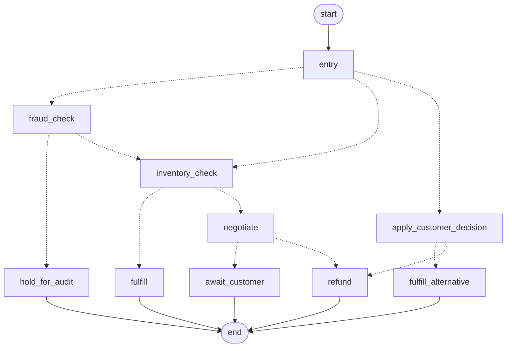

# OrderOps AI — Autonomous Order Triage & Resolution Agent

Post-checkout automation for an e-commerce store. Instead of cancelling an order when an
item is out of stock, the agent risk-scores it, checks live inventory, and negotiates a
discounted alternative with the customer — recovering revenue that would otherwise be lost.

## Architecture

| Layer | Technology |
|---|---|
| Orchestration | LangGraph (`StateGraph` + conditional edges) |
| Backend | Python, FastAPI |
| Database | PostgreSQL |
| ORM / Migrations | SQLAlchemy, Alembic |
| Frontend | React 19, Vite, React Router |

### The workflow graph

Every branch below is a LangGraph conditional edge (`backend/app/graph.py`):



Durable state lives in Postgres rather than a graph checkpointer. Each human pause
(`hold_for_audit`, `await_customer`) ends the run; the approve and respond endpoints
re-enter the graph at `entry` with a different `phase`, and the router dispatches to the
right node. That re-entry is the cycle, and it survives a process restart because the
order row — not an in-memory checkpoint — is the source of truth.

## Setup

Requires Python 3.11+, Node 18+, and a running PostgreSQL.

### Backend

```bash
cd backend
pip install -r requirements.txt

createdb orderops_db
cp .env.example .env          # then set DATABASE_URL to your own credentials

alembic upgrade head          # creates the schema
python seed.py                # loads the 7-item catalog

uvicorn app.main:app --reload --port 8000
```

Interactive API docs: <http://localhost:8000/docs>

### Frontend

```bash
cd frontend
npm install
cp .env.example .env          # only needed if the API is not on localhost:8000
npm run dev                   # http://localhost:5173
```

The UI reads and writes through the API above — there is no client-side copy of the
workflow. Start the backend first, or the pages will show a connection error.

## Deployment (Vercel + Neon)

The frontend and backend deploy as **two separate Vercel projects** from this one repo,
each with its own Root Directory.

### 1. Database — Neon

Create a project at [neon.tech](https://neon.tech) and copy the **pooled** connection
string (it contains `-pooler`). A direct string exhausts the connection limit, because
every serverless invocation opens its own.

Create the schema and catalog from your machine — migrations do not run on Vercel:

```bash
cd backend
DATABASE_URL="postgresql://...-pooler.../neondb?sslmode=require" alembic upgrade head
DATABASE_URL="postgresql://...-pooler.../neondb?sslmode=require" python seed.py
```

### 2. Backend project

| Setting | Value |
|---|---|
| Root Directory | `backend` |
| Framework Preset | Other |
| Env: `DATABASE_URL` | the pooled Neon string |
| Env: `ALLOWED_ORIGINS` | your frontend URL, e.g. `https://orderops-ai.vercel.app` |

`vercel.json` rewrites every path to the ASGI function in `api/index.py`. Verify with
`curl https://<backend>.vercel.app/health`.

### 3. Frontend project

| Setting | Value |
|---|---|
| Root Directory | `frontend` |
| Framework Preset | Vite |
| Env: `VITE_API_URL` | your backend URL, e.g. `https://orderops-api.vercel.app` |

`VITE_API_URL` is inlined at **build** time, so set it before deploying — changing it
later requires a redeploy, not just a restart.

### Serverless caveats

- **Uptime** is process uptime. Serverless processes are recycled constantly, so the
  dashboard tile will read near zero regardless of real availability. The
  `db_healthy` flag beside it is the meaningful signal.
- **Cold starts** of 2-5s occur after idle while SQLAlchemy and LangGraph import, which
  shows up as an outlier in the processing-time metric on the first request.

Neither affects correctness. A long-lived host (Render, Railway, Fly) avoids both and
suits a stateful workflow engine better, at the cost of running two platforms.

## API

| Method | Endpoint | Purpose |
|---|---|---|
| `GET` | `/health` | Liveness + database reachability |
| `GET` | `/items` | Product catalog with live stock |
| `POST` | `/orders` | Create an order and run it through the graph |
| `GET` | `/orders` | All orders, newest first |
| `GET` | `/orders/{id}` | One order with its offer and full event history |
| `POST` | `/orders/{id}/approve` | Manual audit cleared — resume at inventory validation |
| `POST` | `/orders/{id}/respond` | Customer accepted or declined the alternative |
| `GET` | `/metrics` | The BRD success metrics |

Example — an out-of-stock order that triggers negotiation:

```bash
curl -X POST http://localhost:8000/orders \
  -H 'Content-Type: application/json' \
  -d '{"customer_name":"Sara Khan","item_id":6,"quantity":1,
       "customer_email":"sara@example.com"}'
```

The response comes back `awaiting_customer_response` with a `negotiation_offer`. Accept it:

```bash
curl -X POST http://localhost:8000/orders/1/respond \
  -H 'Content-Type: application/json' -d '{"accepted":true}'
```

## Business rules

- **Fraud check** — an order is flagged `high` risk when its value exceeds $500 or the
  quantity exceeds 5 units. High-risk orders stop before inventory is touched.
- **Inventory validation** — stock is decremented under a `SELECT … FOR UPDATE` row lock,
  so two concurrent orders cannot oversell the same units.
- **Alternative selection** — only items that cover the full quantity are eligible, and
  the closest price to the original wins (cheaper breaks a tie). Picking the first match
  would answer an out-of-stock $55 keyboard with a $30 mouse.
- **Offer delivery** — email if an address is on file, SMS otherwise
  (`backend/app/notifications.py`).
- **Re-validation** — a substitute can sell out while the customer is deciding, so stock
  is re-checked at acceptance; if it is gone, the order refunds.

## Success metrics

`GET /metrics` reports:

- **Revenue Recovery Rate** — share of *settled* out-of-stock cases saved by negotiation.
  Offers still awaiting a reply are excluded rather than counted as failures.
- **Processing Time** — agent latency from intake to fulfilment or offer sent. Deliberately
  separate from `resolved_at`, which for a negotiated order waits on the customer and so
  measures human time, not system time.
- **System Uptime** — process uptime and live database reachability.

## Current limitations

- `ConsoleNotifier` logs offers instead of sending them. Real SMTP/Twilio transports plug
  into the `Notifier` protocol.
- Alternative selection is a price-proximity heuristic, not an LLM reasoning over customer
  preference.
- Admin endpoints are unauthenticated.
